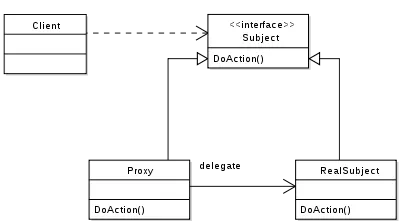

# Java中的静态代理和动态代理

### Q1：什么是代理？

A：代理是设计模式的一种，代理类**(Proxy Subject)**为委托类**(Real Subject)**提供消息预处理，消息转发，事后消息处理等功能。



更明白的说，如果RealSubject是明星，ProxySubject是经纪人，如果想谈明星来演出，则跟经纪人说就能实现明星演出这件事，但经纪人在安排明星演出这件事上，还需要做其他的一些事情，比如出场费的讨论、安保工作和行程安排等。经纪人就是明星的代理人。


### Q2：什么是静态代理？什么是动态代理？

Java中的静态代理要求代理类和委托类都实现同一接口。静态代理中代理类在编译期就已经确定，而动态代理则是JVM运行时动态生成的，静态代理的效率相对于动态的代理来说相对高一点，但是静态代理代码冗余太大，一旦需要修改接口，代理类和委托类都要修改。

#### **静态代理**

**接口(Subject):**

```Java
/**
 * 定义一个明星接口StarObject
 */
public interface StarObject {
	public void show(String name);
}
```

**委托类(RealSubject):**

```Java
/**
* 定义一个委托类Star实现接口StarObject,使其具有一定的业务能力
 */
public class Star implements StarObject {
	@Override
	public void show(String name) {
		System.out.println("我是明星"+name+"，我在演出。");
	}

}

```

**代理类(ProxySubject):**

```Java
/**
* 代理类Broker同样实现StarObject接口的方法，在代理类中即可实现委托类的方法又可以增加自己想要的方法
 */
public class Broker implements StarObject {
	private Star star;	//实例委托类的对象，方便在后面调用委托类实现接口的方法
	
	public Broker(Star star) {
		this.star = star;
	}

	@Override
	public void show(String name) {
		System.out.println("我是经纪人，现在去叫" + name + "来演出。");
		star.show(name);
        System.out.println("我是经纪人，" + name + "演出结束，谢谢大家。");
	}

}
```

**测试类(Client):**

```java
public class Client {

	public static void main(String[] args) {
		// 静态代理模式
		StarObject star = new Broker(new Star());
		star.show("Jack Ma");
	}
}
```

------

#### 动态代理

**动态代理类(ProxyDynamic):**

```

```


### Q3：静态代理和动态代理间的联系是？

